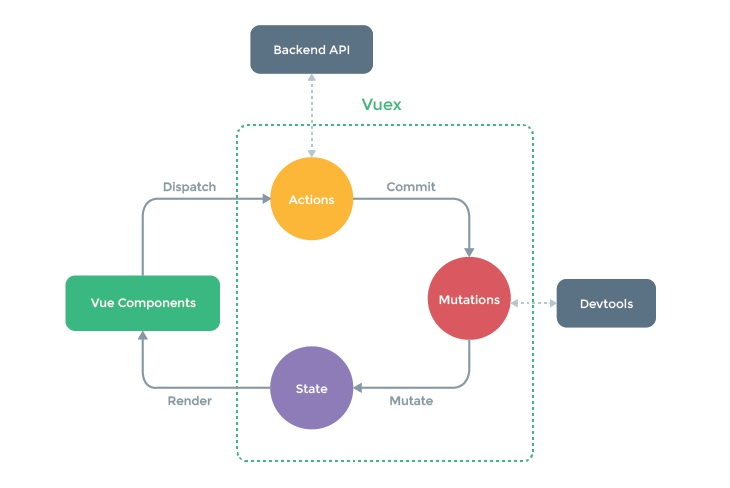

# Vuex 설치 및 Vuex가 적용된 앱 구조 소개

현재 : api -> newsview

vuex적용 : api -> vuex -> newsview

```
npm i vuex
```


# Vuex모듈화 및 state 적용 

Vuex는 상태관리도구.

상태라는 것은 여러 컴포넌트간에 공유되는 데이터 속성


store폴더를 만들어 따로관리.

```
Vue.use(Vuex);
```

Vuex는 플러그인형태이기 때문에 Vue.use를 작성.


new Vuex.Store도 인스턴스이므로 인스턴스를 내보내기위해

```
export const store = new Vuex.Store({ ... })
```


# NewsView에 actions와 mutations 적용

api를 vuex에서 동작시킬 때, actions에서 동작.



actions는 vue 컴포넌트에서 dispatch를 이용해 불러 올 수 있다.

actions는 backend api를 이용해 mutations에 넘겨주기 위한 속성

```vue
this.$store.dispatch('FETCH_NEWS');
```

```
state.news = response.data 사용불가!
```


vuex구조상 actions에서 state로 바로 못넘긴다. mutation을 갔다가 state로가야함.

action : api호출만.

mutation: 데이터를담음.


commit으로 mutation으로 감.

```
context.commit('SET_NEWS', response.data);
```


mutation에서

```vue
SET_NEWS(state, news) {
	state.news = news;
}
```


# [실습] map 헬퍼 함수를 이용한 AskView 풀이

```
<div v-for="(item, index) in ask" :key="index">{{ item.title }}</div>
...

import {mapState} from 'vuex';
...

computed:{
...mapState({
            ask: state => state.ask
        })
}
```

ask에 담는다.


mapState를 써도되지만, getters를 써도됨.

getters는 computed와 동일한속성인데, store에 있는거다.


mapGetters이용

```
...mapGetters({
	fetchedAsk: 'fetchedAsk'
})
```


fetchedAsk를 바로쓰고싶으면 객체가아니라 배열로 사용하면된다.

```
...mapGetters([
	'fetchedAsk'
])
```


# 스토어 속성 모듈화

한눈에 보기 쉽게하기위해 mutations나 actions를 파일을 따로 만들어관리.

