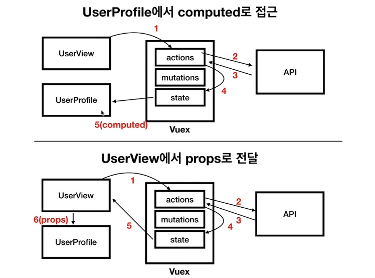

# 사용자 프로필 컴포넌트 소개 및 등록

유저 컴포넌트가 쓰일곳 :  news, ask


# 사용자 컴포넌트 데이터 흐름 처리 1

userprofile로 데이터 옮기기

vuex를 사용하면 데이터 처리 길들이 많아진다.

ex) store로 받은 데이터를 :propsdata="userInfo"를 사용해서 데이터를 넘겨줌.

```
<user-profile :propsdata="userInfo"></user-profile>
```


1. UserView의 computed에 있던 내용을 UserProfile에서 그대로 사용.

   FETCH_USER를 통해 state의 user에 저장이 UserView에서 되고,

   UserProfile에서 userInfo()로 가져옴.

   

# 사용자 컴포넌트 데이터 흐름 처리 2

props

UserVIew에서

```vue
<user-profile :info="userInfo"></user-profile>
```

로 데이터를 보내고,


UserProfile에서

```vue
props: {
	info: Object,
},
```

로 받아 info.~~로 데이터를 출력.


# 2가지 데이터 처리 흐름 비교




vuex흐름에 맞게 하려면 데이터를 쓰는곳에서 state의 데이터를 땡겨 쓰면된다. (1번)


props는 컴포넌트 태그차원에서 명시적으로 표현하는 이점있다.

둘다 틀린건 아니니까 상황에 맞게 사용.

# slot을 이용한 사용자 프로필 컴포넌트 구현

```vue
<div class="user-description">
    <slot name="username">
        <!--상위 컴포넌트에서 정의할 영역 -->
    </slot>
    <div class="time">

        <slot name="time">

        </slot>
    </div>
</div>
```

slot name으로 slot을 열어놓고,

해당 컴포넌트를 사용하는곳에서

```vue
<div slot="username">{{ fetchedItem.user }}</div>
<template slot="time">
    <div>{{ fetchedItem.time_ago }}</div>
</template>
```

name을 동일하게 입력해주면 연결이된다.

template태그의 내용은 나중에 태그없이 텍스트로 들어감.


v-if와 다른점

상위에서 구현하여 넣음.

# 사용자 프로필 컴포넌트 스타일링 및 코드 정리

ItemView -> info.user

UserView -> info.id등 다른부분을 tempalte와 slot으로 정리.